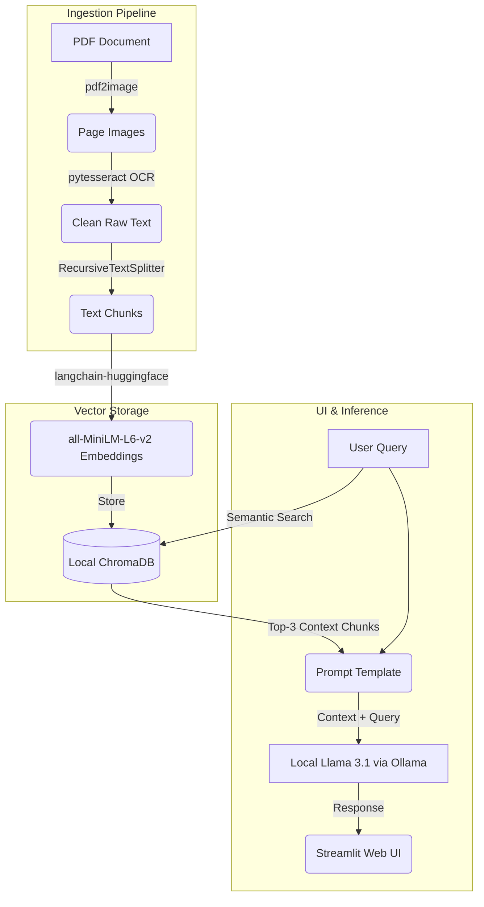

# 🤖 Local RAG Document Chat Assistant

A privacy-focused, fully local **Retrieval-Augmented Generation (RAG)** system that allows users to have an interactive chat with their PDF documents. The application runs entirely offline on your local machine, ensuring complete data privacy with zero API costs.

---

## 📊 System Architecture

This project implements a complete Applied AI pipeline from raw document ingestion to an interactive web interface. GitHub renders the architecture below automatically:



---

## 📸 Application Demo

---

## 🛠️ Tech Stack & Core Components

* **Orchestration:** `LangChain` & `langchain-core`
* **Frontend UI:** `Streamlit` (Interactive dual-column chat interface)
* **LLM Inference:** `Ollama` running a quantized local `Llama 3.1`
* **Vector Database:** `ChromaDB` (via `langchain-chroma`)
* **Text Embedding:** `HuggingFaceEmbeddings` (`all-MiniLM-L6-v2`, 384-dimensional vectors)
* **Data Ingestion & OCR:** `PyTesseract` (Google OCR Engine) & `pdf2image`

---

## 🚀 Quick Start Guide

Follow these steps to set up and run the project locally:

### 1. Prerequisites

* Install **Python 3.10+**
* Install **Ollama** and pull the model: `ollama pull llama3.1`
* Install **Tesseract OCR** on your system and ensure it is accessible in your script config.

### 2. Installation

Clone the repository and navigate into the project directory:

```bash
git clone [https://github.com/YamenSA/local-rag-document-pipeline.git](https://github.com/YamenSA/local-rag-document-pipeline.git)
cd local-rag-document-pipeline

```

Create and activate a virtual environment:

```bash
python -m venv venv
# On Windows PowerShell:
.\venv\Scripts\Activate.ps1

```

Install the required dependencies:

```bash
pip install -r requirements.txt

```

### 3. Usage

1. Place your target PDF file inside the `data/` directory and name it `test.pdf`.
2. Initialize the database and run the OCR ingestion pipeline:

```bash
    python src/vector_store.py
    ```
3.  Launch the interactive Streamlit Web App:
```bash
    streamlit run app.py
    ```

---

## 🔒 Privacy & Security Notice
This application requires **no external API keys** and sends **no data** over the internet. The PDF text extraction, vector embed generation, database storage, and LLM text generation occur entirely locally on your hardware.

```